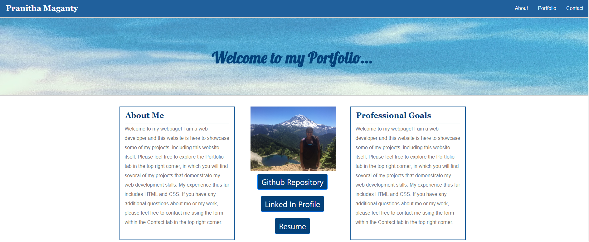
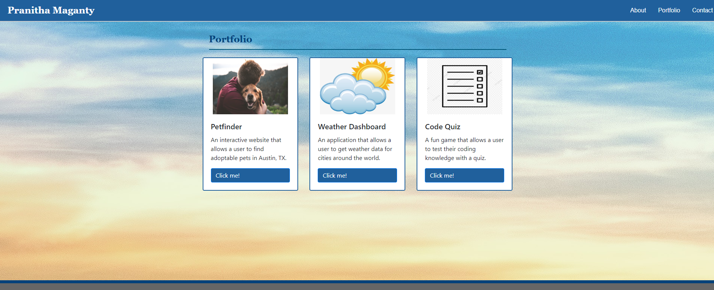
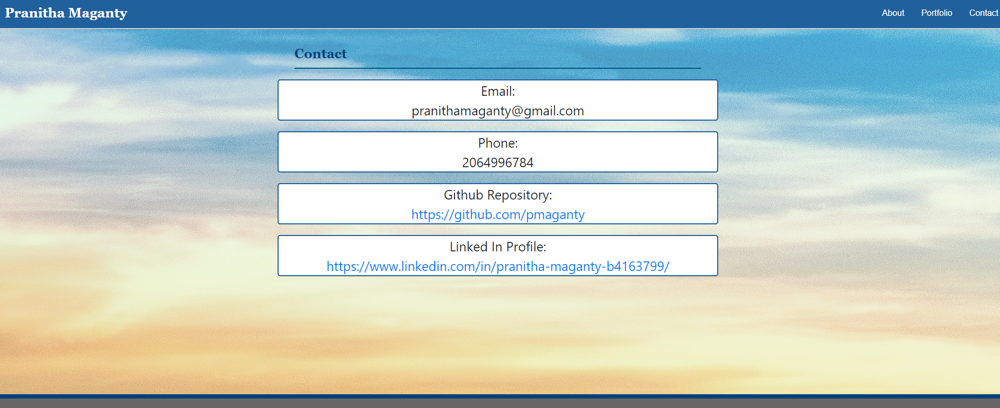

## Project: Portfolio
## Author: Pranitha Maganty
### Description: This is an official portfolio intended to showcase my projects and skills.
### Github Repo Link: https://github.com/pmaganty/official_portfolio
### Github Pages Link: https://pmaganty.github.io/official_portfolio/index.html

#### Features:
+ Navbar: Includes 3 pages to navigate to, which include, "about me" "portfolio and "contact"
+ Page 1 About Me: Description about myself and my professional goals.
    - Includes picture of myself.
    - Includes 3 buttons that when clicked take you to the respective location or document. These include my github repo, linked in profile, and resume.

+ Page 2 Portfolio: Contains pictures, descriptions, and links to webpages or projects that I have created.

+ Page 3 Contact: Contains contact info you can use to reach me if needed.

#### File Contents:
+ index.html
    - contains html that renders Page 1 About Me
+ portfolio.html
    - contains html that renders Page 2 Portfolio
+ contact.html
    - contains html that renders Page 3 Contact
+ style.css
    - contains all css code that styles webpage
+ images
    - contains all images used in webpage
+ resume.docx
    - my professional resume
